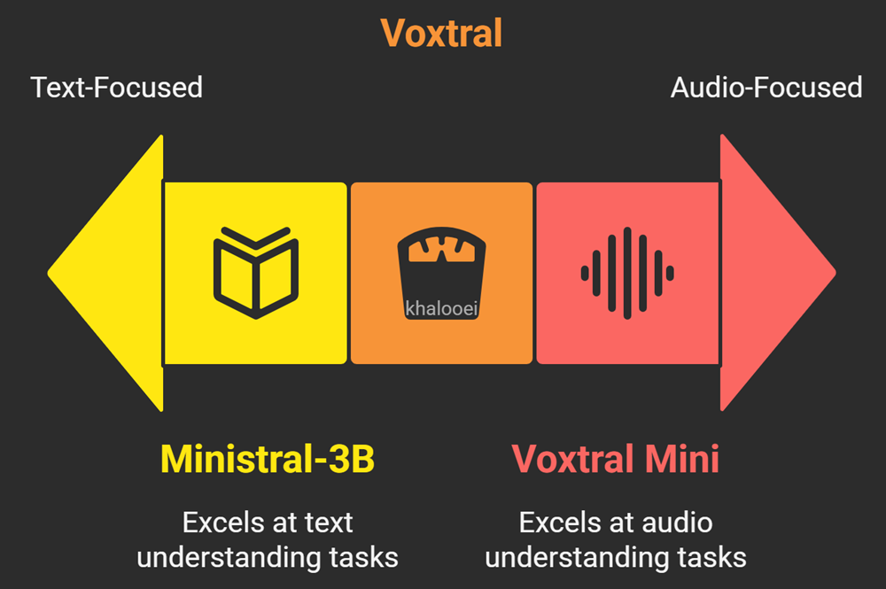
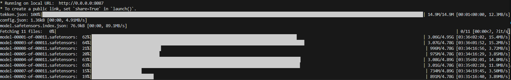
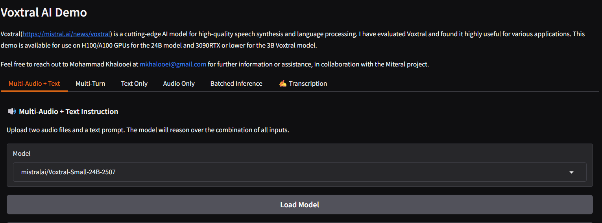
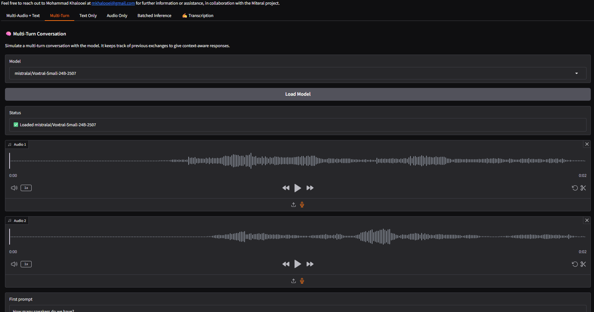
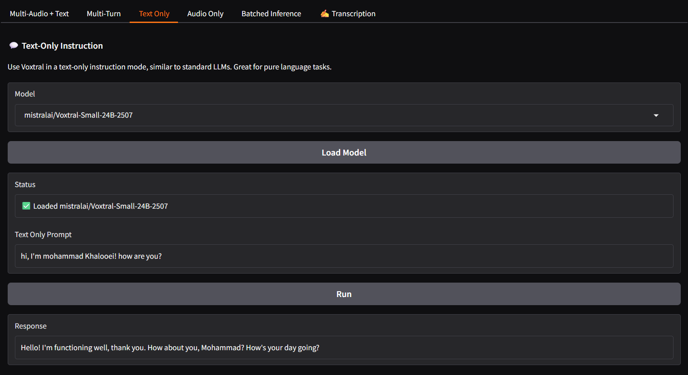

# Voxtral AI Demo Interface 



Welcome to the **Voxtral AI Demo Interface**! This project provides a user-friendly interface to interact with **Voxtral**, a cutting-edge **speech understanding** model designed for high-quality transcription, language understanding, and multilingual fluency.

### Overview

**Voxtral** is a state-of-the-art model developed to handle both **speech transcription** and **audio understanding** with remarkable accuracy and efficiency. The Voxtral models are optimized for **long-form context**, **multilingual capabilities**, and **natural language understanding** directly from audio. This demo interface lets you run the Voxtral model on powerful GPUs to evaluate its performance and see how it can be used for transcription and deeper analysis.

I have tested Voxtral thoroughly, and based on my evaluation, I have created this app for wide usage. It meets the required performance and works efficiently under the recommended hardware setups [](https://github.com/khalooei/Voxtral-AI-Demo-Local-Interface)
.

### Features

- **Speech Transcription**: Generate high-accuracy transcriptions from audio, supporting long-form speech with up to 32k tokens.
- **Audio Understanding**: Beyond transcription, Voxtral can answer questions or generate structured summaries directly from speech.
- **Multilingual**: Supports automatic language detection and state-of-the-art performance in widely used languages like English, Spanish, French, Portuguese, Hindi, German, and more.
- **Built-in Q&A and Summarization**: Directly ask questions about the audio content or generate structured summaries without needing separate models.
- **Function-Calling from Voice**: Trigger backend functions or API calls based on spoken user intents, turning voice interactions into actionable commands.
- **Affordable and Open**: Voxtral bridges the gap between open-source ASR systems and expensive proprietary APIs, delivering production-ready speech understanding at a fraction of the cost.

### Hardware Requirements
As mentioned, I have tested Voxtral thoroughly, and based on my evaluation, I have created this app for wide usage. It meets the required performance and works efficiently under the recommended hardware setups.
- **24B Voxtral Model**: Recommended for **H100/A100 GPUs**.
- **3B Voxtral Model**: Works well on **4090RTX, 3090RTX or lower GPUs**.

### How to Use

1. **Clone the repository**:
   ```bash
   git clone https://github.com/khalooei/voxtral-ai-demo.git
   ```

2. **Install dependencies**:
   - Install Python 3.10+ if not already installed.
   - Create a virtual environment and activate it:
     ```bash
     python -m venv venv
     source venv/bin/activate  
     ```

3. **Install the required Python packages**:
   ```bash
   pip install -r requirements.txt
   ```

4. **Run the app**:
   ```bash
   python app.py
   ```

   After the application starts, open the web interface in your browser (usually at `http://localhost:8087`).

5. **Model Download**:
   - When you first run the app and select a model, it will **automatically download** the necessary model files to your local machine. This step happens **only once** to ensure that the models are available for local use.
   - Select a model from the dropdown menu at the top (either **Voxtral-Small-24B** or **Voxtral-Mini-3B**) and click **Load Model** to initialize the model. Once loaded, the tabs will become available for different tasks such as transcription, multi-turn conversation, audio analysis, and batch inference.



6. **Interacting with the App**:
   - **Multi-Audio + Text**: Upload two audio files along with a text prompt to analyze them together.
   - **Multi-Turn Conversation**: Simulate a conversation where the model responds to multiple audio inputs and prompts.
   - **Text Only**: Enter a text-only prompt to simulate typical LLM responses.
   - **Audio Only**: Upload a single audio file for analysis and generate a response based on the content.
   - **Batched Inference**: Upload multiple conversations and have them processed in bulk.
   - **Transcription**: Upload an audio file to generate a text transcription of the spoken content.




### Example Usage

- **Transcription**: Upload an audio file and receive a text transcript.
- **Multi-Turn Conversation**: Upload two audio files and provide prompts for a conversational interaction.
- **Batch Processing**: Submit multiple audio and text inputs for bulk processing in JSON format.

### Support
If you have any questions or need assistance, feel free to reach out to **Mohammad Khalooei** at **mkhalooei[at]gmail.com**,  **khalooei[at]aut.ac.ir** or **mohammad.khalooei[at]sharif.edu**.

This demo is provided in collaboration with the **Mistral AI**.

### Demo Screenshots
Here are some screenshots of the **Voxtral AI Demo Interface** in action:
  

  

  

### References
- https://huggingface.co/mistralai/Voxtral-Mini-3B-2507
- https://huggingface.co/mistralai/Voxtral-Small-24B-2507

### License
This project is licensed under the MIT License - see the [LICENSE](LICENSE) file for details.